# Traffic Sign Classification

[](LICENSE)[](https://www.codacy.com/manual/frgfm/sdcnd-p3-traffic-sign-classification?utm_source=github.com&amp;utm_medium=referral&amp;utm_content=frgfm/sdcnd-p3-traffic-sign-classification&amp;utm_campaign=Badge_Grade) [](https://circleci.com/gh/frgfm/sdcnd-p3-traffic-sign-classification) [](https://codecov.io/gh/frgfm/sdcnd-p3-traffic-sign-classification)

This repository is an implementation of an image classification pipeline for the traffic sign classification of Udacity Self-Driving Car Nanodegree (cf. [repo](<https://github.com/udacity/CarND-Traffic-Sign-Classifier-Project>)).


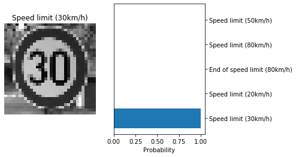


## Table of Contents

- [Getting Started](#getting-started)
  - [Prerequisites](#prerequisites)
  - [Installation](#installation)
- [Usage](#usage)
- [Approach](#Approach)
- [Credits](#credits)
- [License](#license)


## Getting started

### Prerequisites

- Python 3.6 (or more recent)
- [pip](https://pip.pypa.io/en/stable/)

### Installation

You can install the project requirements as follows:

```shell
git clone https://github.com/frgfm/sdcnd-p3-traffic-sign-classification.git
cd sdcnd-p3-traffic-sign-classification
pip install -r requirements.txt
mkdir data
```

Get the German Traffic Dataset from [here](https://s3-us-west-1.amazonaws.com/udacity-selfdrivingcar/traffic-signs-data.zip) and extract its content in the `data` folder to be able to train. Download the class [labels](https://raw.githubusercontent.com/udacity/CarND-Traffic-Sign-Classifier-Project/master/signnames.csv) and put them in the same folder.

You can download the trained [model](https://github.com/frgfm/sdcnd-p3-traffic-sign-classification/releases/download/v0.1.0/model.h5) (put the checkpoint in the `./data` folder) and the testing [images](https://github.com/frgfm/sdcnd-p3-traffic-sign-classification/releases/download/v0.1.0/test_images.zip) (extract it to a `test_images` folder) from the latest release.


*Note: if you wish to use CPU only, replace the `tensorflow-gpu` dependencies with `tensorflow`*


## Usage

### Training

A training script is available to train an image classifier on the training dataset.

```
usage: train.py [-h] [--folder FOLDER] [--batch-size BATCH_SIZE] epochs

Traffic sign classification training

positional arguments:
  epochs                Number of epochs to train

optional arguments:
  -h, --help            show this help message and exit
  --folder FOLDER       Path to data folder (default: ./data)
  --batch-size BATCH_SIZE
                        Batch size (default: 128)
```


### Test

An inference script is available for you to test out your trained model or the one from th release.

```
usage: test.py [-h] [--folder FOLDER] [--model MODEL] imgfolder

Traffic sign classification training

positional arguments:
  imgfolder        Path to image folder

optional arguments:
  -h, --help       show this help message and exit
  --folder FOLDER  Images to test (default: ./data)
  --model MODEL    Path to model checkpoint (default: ./data/model.h5)

```


### Activation visualization

Finally you can check the activation on specific layers of your trained model.

```
usage: visualize.py [-h] [--layer LAYER] [--folder FOLDER] [--model MODEL] img

Traffic sign classification activation visualization

positional arguments:
  img              Path to image

optional arguments:
  -h, --help       show this help message and exit
  --layer LAYER    Layer name (options: conv2d, max_pooling2d, conv2d_1,
                   max_pooling2d_1) (default: conv2d)
  --folder FOLDER  Images to test (default: ./data)
  --model MODEL    Path to model checkpoint (default: ./data/model.h5)
```


## Approach

### Dataset

The dataset has 34799 training examples, 4410 validation examples and 12630 testing examples Each sample is an RGB image of shape: (32, 32, 3). Labels include 43 classes of traffic signs.

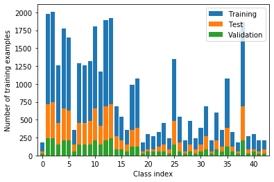

The class distribution is imbalanced as shown below.


### Architecture

As suggested by the default repository, the LeNet5 architecture was used for image classification.


*Source: Gradient-based learning applied to document recognition (1998)*


By introducing dropout in the fully connected layers, we get our final model:

```shell
Model: "sequential"
_________________________________________________________________
Layer (type)                 Output Shape              Param #   
=================================================================
conv2d (Conv2D)              (None, 28, 28, 6)         156       
_________________________________________________________________
max_pooling2d (MaxPooling2D) (None, 14, 14, 6)         0         
_________________________________________________________________
conv2d_1 (Conv2D)            (None, 10, 10, 16)        2416      
_________________________________________________________________
max_pooling2d_1 (MaxPooling2 (None, 5, 5, 16)          0         
_________________________________________________________________
flatten (Flatten)            (None, 400)               0         
_________________________________________________________________
dense (Dense)                (None, 120)               48120     
_________________________________________________________________
dense_1 (Dense)              (None, 84)                10164     
_________________________________________________________________
dropout (Dropout)            (None, 84)                0         
_________________________________________________________________
dense_2 (Dense)              (None, 43)                3655      
=================================================================
Total params: 64,511
Trainable params: 64,511
Non-trainable params: 0
```


### Training sequence

Using a flat learning rate over 10 epochs (cf. `train.py`), the training procedure yields very positive results with a final validation accuracy of 95.92%.

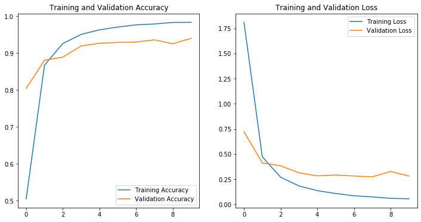

The accuracy over the testing set reaches 92.52%, which shows a good generalization capacity of the model.


### Evaluation on new images

Using the `test.py` script, we can inspect the predictions of the trained model over the test images. Feel free to use your own.

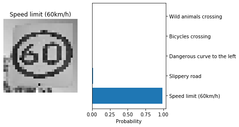

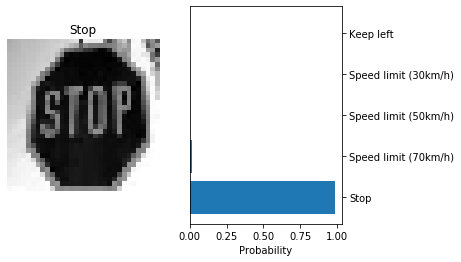

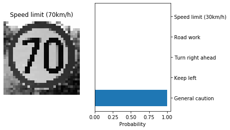

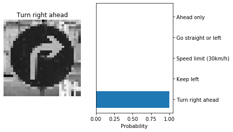

With this limited dataset, the aggregated accuracy of the model is 62.50%. A larger dataset would confirm potential ideas to improve the architecture and training procedure.


### Feature visualization

Finally, by passing data through the trained model, we can visualize the activation of specific feature layers for a given image. Below are examples of different layers for a sample image.


1st convolution layer

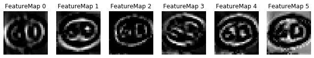

1st maxpooling layer

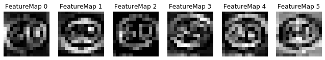

2nd convolution layer

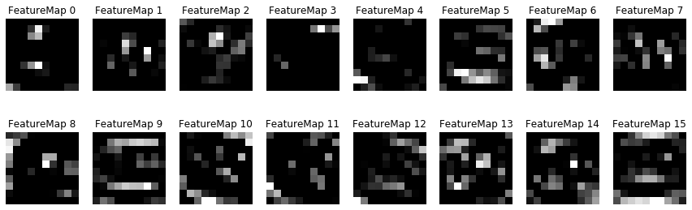

2nd maxpooling layer

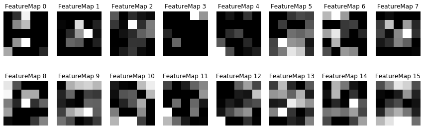


## Credits

This implementation is vastly based on the following methods:

- [Gradient-based Learning Applied to Document Recognition](http://yann.lecun.com/exdb/publis/pdf/lecun-01a.pdf)
- [Dropout: A Simple Way to Prevent Neural Networks from Overfitting](http://jmlr.org/papers/volume15/srivastava14a/srivastava14a.pdf)


## License

Distributed under the MIT License. See `LICENSE` for more information.